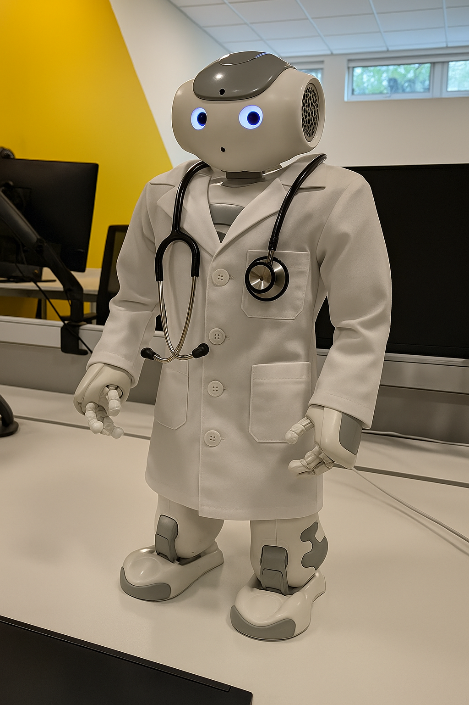

# 🤖 NAO Robot Physiotherapist 💪

Welcome to the **NAO Robot Physiotherapist** repository! This project is all about using the amazing NAO robot 🧍‍♂️ as a physiotherapist, specifically designed to help patients with their rehabilitation and recovery journey after Anterior Cruciate Ligament (ACL) surgery 🦵.



**🎬 Lights, Camera, Action!** Check out NAO in action:
* Watch NAO perform a **lunge**: [Click Here!](media/nao_lunge.mp4) 🤸‍♀️
* See NAO demonstrate a **heel slide**: [Take a Look!](media/nao_heel_slide.mp4) 🦶

---

## ✨ Getting Started

### 🆕 New Patient Setup
Before you begin, please personalize the experience by editing the new patient's name in the `speech_functions.py` file.
✏️ `speech_functions.py`

### 🚀 Run the Robot
To bring your NAO physiotherapist to life, run the following command in a Python 2.7 environment with the NAO SDK installed:

```shell
python robot_physiotherapist.py
```

### 🏋️‍♀️ Exercises 
All the exercises NAO can perform are neatly organized in the exercises folder 📁.


**Want to teach NAO a new move? It's easy!**
1. **Edit Files:** You'll need to make changes in both the speech_functions.py (for verbal cues) and the logic.py file (for the exercise logic).
2. **Add Exercise File:** Place your new exercise script (e.g., new_exercise.py) into the exercises folder.
3. **Import:** Don't forget to import your new exercise in the logic.py file.

👀 For an example of how an exercise is structured, take a peek at the squat.py file.
